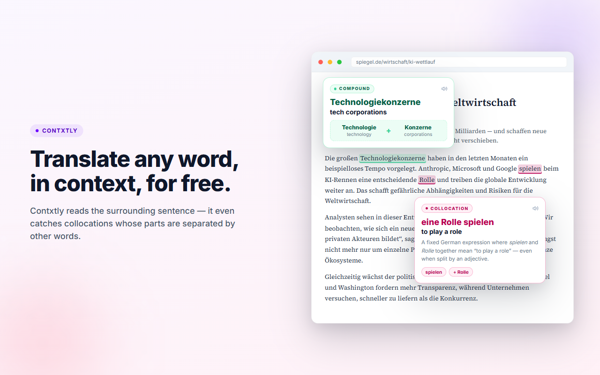
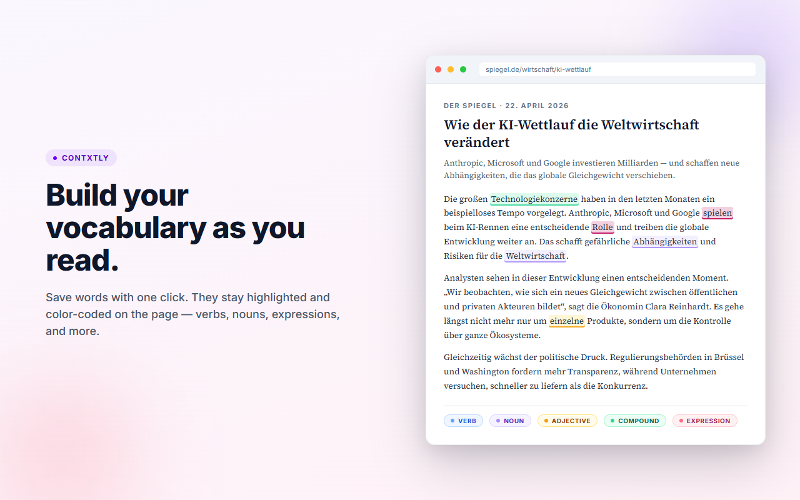
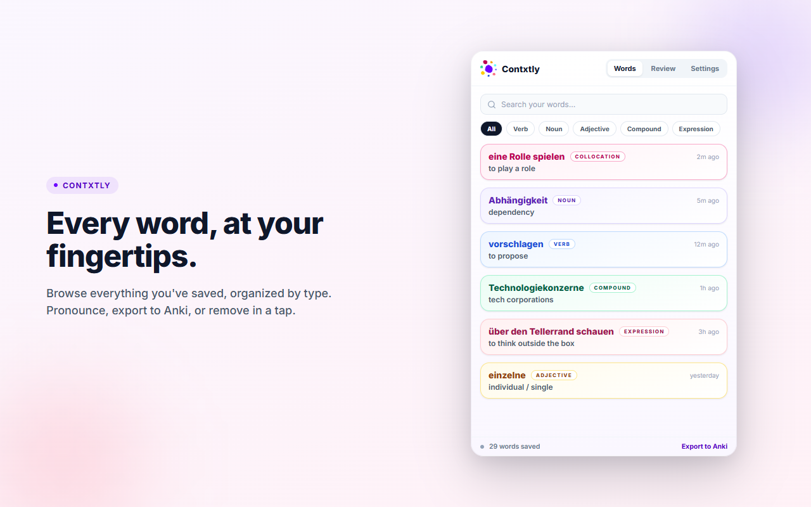
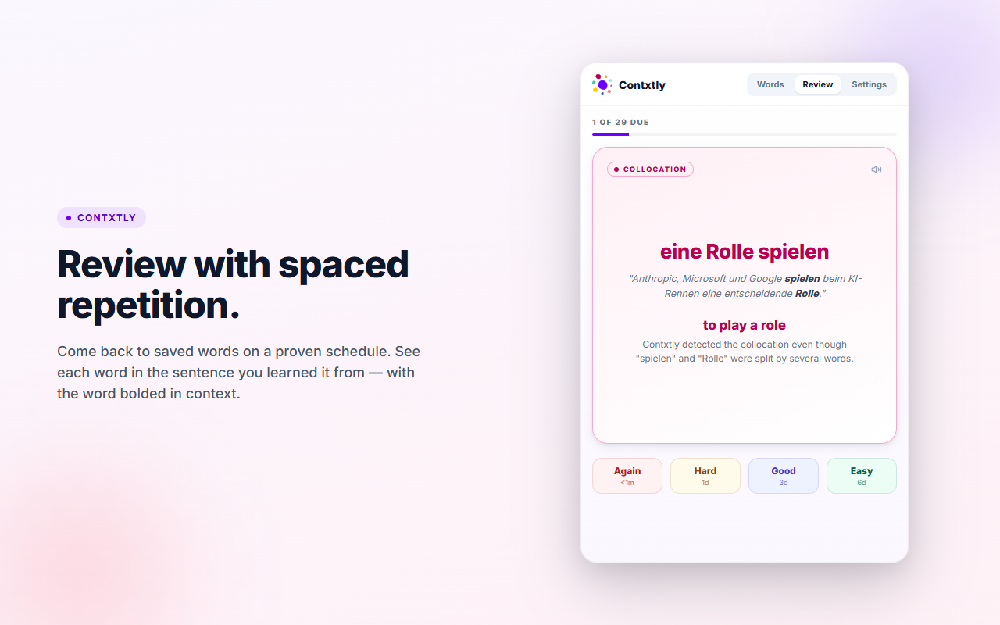

<div align="center">
  

  # Contxtly

  **Context-aware translation for language learners.**
  Highlight any word on any page — get the meaning that fits the sentence.

  [](#status)
  [](LICENSE)

</div>

---

## Status

Contxtly was submitted to the Chrome Web Store on **April 25, 2026** and is currently **under review by Google**. This README and badge will be updated with the public listing link as soon as the extension is approved and published.

In the meantime, the full source for the extension, backend, and infrastructure is available in this repository.

## Overview

Contxtly turns every article you read into a personal language lesson.

Highlight any word or phrase on any webpage, and Contxtly instantly gives you a translation that actually fits the sentence — not a dictionary guess. It understands context, detects collocations (even when split across a sentence), breaks down compound words, and classifies what you're learning: noun, verb, adjective, expression, or idiom.

## Why Contxtly

- **Context-aware translations** — the same word means different things in different sentences. Contxtly reads the full context before translating.
- **Collocations & expressions** — catches multi-word phrases like *"eine Rolle spielen"* even when split by other words.
- **Compound word breakdown** — long German/Dutch/Scandinavian words get decomposed into their parts.
- **Grammar tags** — every saved word is labeled (noun, verb, adjective, collocation, expression, compound) so you learn patterns, not just vocabulary.

## How It Works

1. Highlight a word or phrase on any page.
2. Click **Save** in the popup — the word, its translation, and the sentence it came from are stored.
3. Review later in the extension's Review tab with spaced-repetition style recall.
4. Export to Anki with one click (optional).

<table align="center">
  <tr>
    <td></td>
    <td></td>
  </tr>
  <tr>
    <td></td>
    <td></td>
  </tr>
</table>

## Features

- Free with a generous daily quota — no account needed beyond Google sign-in
- Works on any website — news, blogs, documentation, social media
- Saves the original sentence as context for every word
- Review mode with grading (Again / Hard / Good / Easy)
- Anki export for power users
- Clean, distraction-free design
- Your data stays yours — synced securely to your account

## Supported Languages

German, French, Spanish, Italian, Dutch, Portuguese, and more.
Translations available in English and your native language.

## Tech Stack

**Extension** — TypeScript, React, Vite, Chrome Manifest V3
**Backend** — Python (FastAPI), spaCy NLP pipeline, Groq LLM API
**Storage** — Supabase (Postgres + Auth), Redis dual-layer cache
**Infra** — Docker, GitHub Actions CI/CD, Stripe billing

## Local Development

```bash
cd backend
python -m venv ../venv
source ../venv/bin/activate
pip install -r requirements.txt
```

Create `.env`:

```env
GROQ_API_KEY=your-key-here
```

Get your key at [console.groq.com](https://console.groq.com).

Run the backend:

```bash
uvicorn main:app --reload
```

Quick test:

```bash
curl -X POST http://localhost:8000/translate \
  -H "Content-Type: application/json" \
  -d '{"text": "ephemeral", "context": "The ephemeral nature of cherry blossoms", "target_lang": "de", "mode": "smart"}'
```

---

<div align="center">
  <i>Built for learners who read real content — articles, books, news — and want to turn every unfamiliar word into lasting vocabulary.</i>
  <br/><br/>
  <b>Context is the teacher.</b>
</div>
